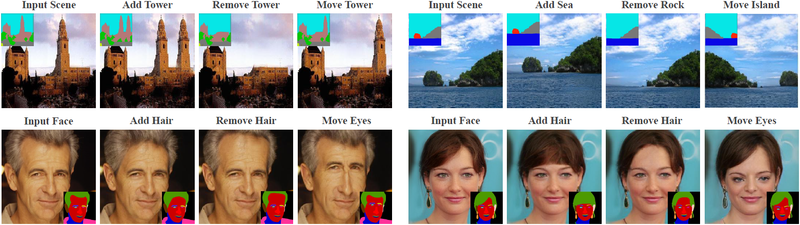

# Bi-level feature alignment for versatile image translation and manipulation


## Preparation
Clone the Synchronized-BatchNorm-PyTorch repository.
```
cd models/networks/
git clone https://github.com/vacancy/Synchronized-BatchNorm-PyTorch
cp -rf Synchronized-BatchNorm-PyTorch/sync_batchnorm .
cd ../../
```

**VGG model** for computing loss. Download from [here](https://drive.google.com/file/d/1fp7DAiXdf0Ay-jANb8f0RHYLTRyjNv4m/view?usp=sharing), move it to `models/`.


## Datasets
For the datasets for translation, please refer to [CoCosNet](https://github.com/microsoft/CoCosNet).

For the datasets for image editing, you can download it from [Google Drive](https://drive.google.com/file/d/1irgkoyjae8hXZ-zZmiUlX1NQjnLbPE9S/view?usp=sharing).


## Translation Results
Some prediction results of our model are provided in [Google Drive](https://drive.google.com/file/d/1to6_wFfMSQ0sA8e8Fl73OuMiHFv8TtbX/view?usp=sharing).


## Training
Then run the command 
````bash
bash train_ade.sh
````

### Citation
If you use this code for your research, please cite our papers.
```
@article{zhan2021rabit,
  title={Bi-level feature alignment for versatile image translation and manipulation},
  author={Zhan, Fangneng and Yu, Yingchen and Wu, Rongliang and Cui, Kaiwen and Xiao, Aoran and Lu, Shijian and Shao, Ling},
  journal={arXiv preprint arXiv:2107.03021},
  year={2021}
}
```

## Acknowledgments
This code borrows heavily from [CoCosNet](https://github.com/microsoft/CoCosNet). We also thank [SPADE](https://github.com/NVlabs/SPADE), [Synchronized Normalization](https://github.com/vacancy/Synchronized-BatchNorm-PyTorch).
